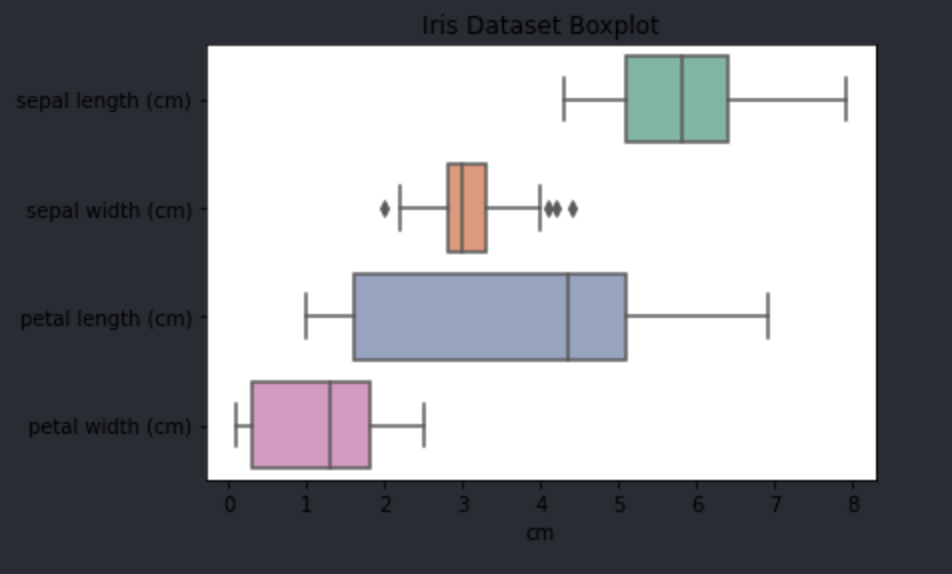
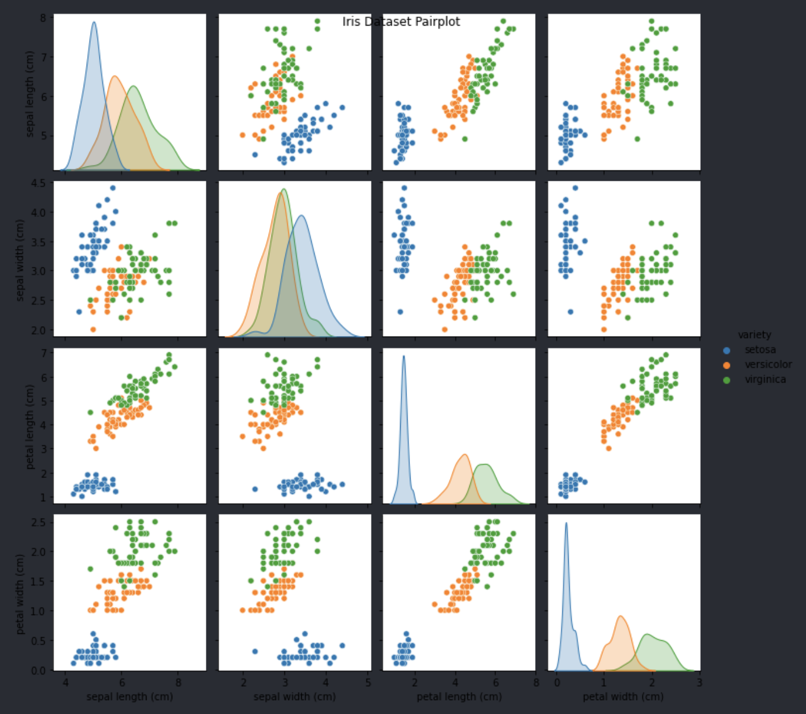
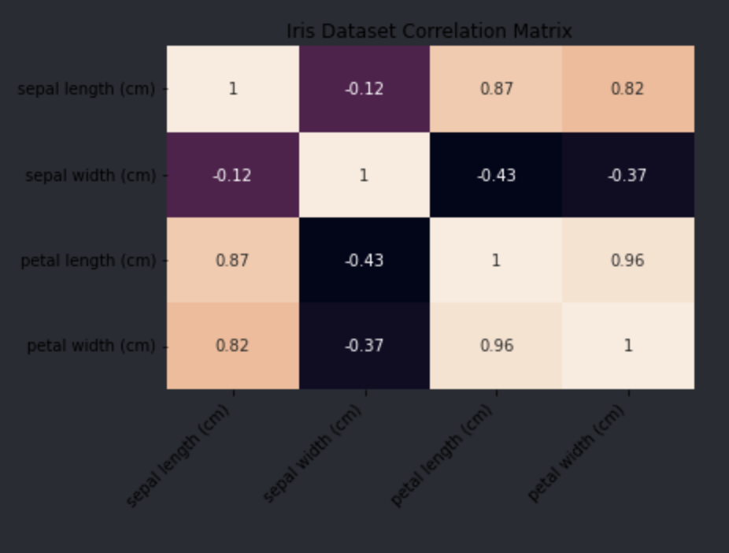
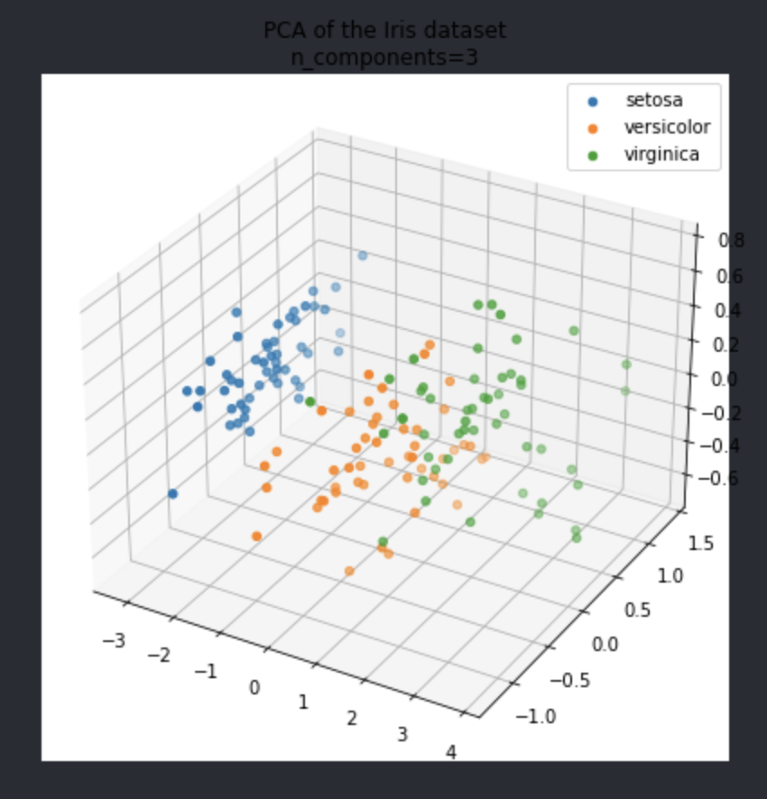

# Wite Up

## 1. Introduction

The Iris dataset is a classic machine learning classification problem, introduced in 1936 by Ronald A.
Fisher. This report aims to create an artificial neural network to accurately classify Iris plants into
three species: Iris Setosa, Iris Versicolour, and Iris Virginica. We tackle the challenge of non-linear
separability between two species through data preprocessing, neural network design, optimization,validation,
and evaluation. Our goal is to provide insights and pave the way for future research in this field.

## 2. Data Analysis and Pre-processing

### Data Analysis

Before the ANN's architecture can be theorised, we first must perform a comprehensive data analysis of the Iris dataset using various visualization techniques. This will allow us to gain a deeper understanding of the relationships between the attributes and the distribution of the different Iris species.

1. **Boxplot**: We created a boxplot to visualize the distribution of each attribute (sepal length, sepal width, petal length, and petal width) across the three Iris species. This plot helped us identify any potential outliers and examine the overall spread of the data.

2. **Pairplot**: A pairplot was generated to illustrate the relationships between all the possible pairs of attributes. This scatterplot matrix allowed us to observe the linear separability of Iris Setosa and the evident overlap between Iris Versicolour and Iris Virginica.

The pairplot reveals that Iris Versicolour and Iris Virginica exhibit overlapping attributes, suggesting that accurately classifying these two Iris species could present challenges.

3. **Correlation Matrix**: We calculated the correlation matrix to quantify the linear relationships between the attributes. By using a heatmap, we could easily identify strong positive correlations between petal length and petal width, as well as between petal length and sepal length.

The correlation matrix details the...

4. **Principal Component Analysis (PCA)**: We performed PCA with three components to reduce the dimensionality of the dataset and project the data onto a lower-dimensional space. A 3D scatterplot was created to visualize the clustering of the Iris species in this reduced space, providing insights into the separability of the classes.

The findings demonstrated that Iris Versicolour and Iris Virginica indeed have overlapping attributes. However, upon incorporating an additional dimension, the overlap appeared less severe, indicating that with appropriate data preprocessing, these species could be classified.

Based on these visualizations and analyses, we gained a better understanding of the underlying structure and relationships within the Iris dataset, and provides a base for preprocessing the data which will be useful for designing and training an effective neural network for Iris classification.

### Data Processing

During the data processing stage, we perform a series of transformations to ensure that the data is properly prepared for the neural network training. These transformations include:

- **Scaling**: To avoid a scenario where features with larger values dominate the objective function, we scale the data to have zero mean and unit variance. This standardization process helps improve the neural network's training efficiency and overall performance.

- **One-hot encoding**: We convert categorical features into binary features through one-hot encoding. This transformation ensures that the model does not interpret categorical features as ordinal, which could lead to inaccurate classifications.

- **Train-test split**: To evaluate the model's performance on unseen data, we divide the dataset into a training set and a test set. The training set is utilized for training the model, while the test set serves as a benchmark for assessing the model's generalization capabilities.

By applying these transformations to the iris datasey, we can effectively preprocess the data, enabling the neural network to learn the underlying patterns and relationships more efficiently. This, in turn, will lead to more accurate and reliable classification results.

## 3. Dataset Representation and Normalization

In the Dataset Representation and Normalization section, we focus on representing input and output data effectively,
normalizing and standardizing features to ensure consistent scales (Laurent et al., 2015), and optionally employing
dimensionality reduction techniques to improve model performance and computational efficiency. This stage is crucial
for training a reliable and accurate neural network .

- Input and output representation
- Data normalization and standardization
- Optional: Dimensionality reduction techniques

## 4. Splitting the Dataset

Data was split into training and testing data in an 80/20 split. 

- Split-sample training (train, validation, and test sets)
- K-fold cross-validation

## 5.Neural Network Design and Architecture

In this section, we focus on the neural network design and architecture for the Iris dataset classification. We will
discuss network topology, including layers, neurons, and activation functions. Additionally, we will explore training
parameters, such as learning rate, momentum, and weight initialization. We will outline the chosen training method,
backpropagation (Hecht-Nielsen, 1992) with the Levenberg-Marquardt algorithm, and discuss strategies for determining
the optimal number of hidden neurons to balance model complexity and performance.

- Network topology: layers, neurons, and activation functions
- Training parameters: learning rate, momentum, weight initialization
- Training method: backpropagation with Levenberg-Marquardt
- Determining the number of hidden neurons

## 6. Training the Neural Network

In this section, we delve into the essential aspects of training the neural network for the Iris dataset classification.
We will cover the selection of an appropriate training algorithm and define stopping conditions that ensure the convergence
of the learning process (Barnard, 1992). Additionally, we will discuss the training procedures for both split-sample and
cross-validation methods, comparing their advantages and disadvantages while highlighting their importance in optimizing
the model's performance and generalization capabilities.

- Training algorithm and stopping conditions
- Training procedure for split-sample and cross-validation methods

## 7. Validation and Testing

- Validation strategies: early stopping, cross-validation
- Testing procedure: model evaluation on the test set

## 8. Experimentation and Analysis

- Experimenting with various neural network parameters
- Comparing model performance and error analysis
- Interpreting feature importance and model limitations

## 9. Conclusion

- Project summary and key findings
- Future work and potential improvements

## References

Barnard, E. (1992). Optimization for training neural nets. IEEE transactions on Neural Networks, 3(2), 232-240.

Feng, C. L. (2021, October). The mathematical analysis and classification research of an iris data set using binary tree and grey relation grade. In Journal of Physics: Conference Series (Vol. 2068, No. 1, p. 012004). IOP Publishing.

Hecht-Nielsen, R. (1992). Theory of the backpropagation neural network. In Neural networks for perception (pp. 65-93). Academic Press.

Laurent, A., & Hauschild, M. Z. (2015). Normalisation. Life cycle impact assessment, 271-300.

Wu, Y., He, J., Ji, Y., Huang, G., Yao, H., Zhang, P., ... & Li, Y. (2019). Enhanced classification models for iris dataset. Procedia Computer Science, 162, 946-954.
